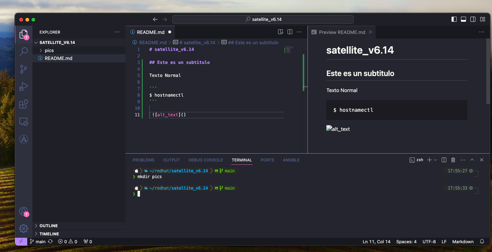

# Satellite_v6.14

The content of this repository aims to be a manual for the familiarization of Red Hat Satellite and its main use cases. This demostration/manual was built using Red Hat Satellite version 6.14.

## Contents

- Vagrantfile file and Ansible playbook to deploy a Red Hat Satellite environment. More information here: https://www.vagrantup.com/.
- Use cases

 